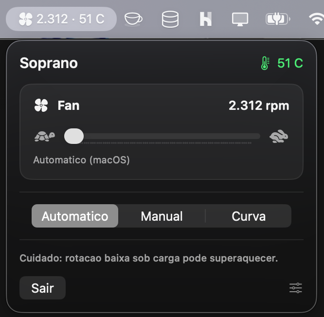

# 🎐 Soprano

**Controle o cooler do seu Mac como se fosse o volume.** O Soprano mora na barra de
menu (lá em cima, perto do relógio) e deixa você deixar o Mac **mais silencioso** ou
**mais gelado** com um slider. Ele também mostra a rotação e a temperatura em tempo real.

<p align="center">
  
</p>

> [!WARNING]
> **Mexer no cooler pode superaquecer o Mac.** Se você segurar a rotação baixa
> enquanto o Mac trabalha pesado (jogo, edição de vídeo, exportação), o calor sobe,
> o desempenho cai sozinho e, no limite, o Mac desliga pra se proteger. Na dúvida,
> use o modo **Automático**: ele devolve o controle ao próprio macOS. Você assume o
> volante por conta e risco.

---

## O que é o Soprano?

Todo Mac tem um **cooler** (ventoinha) que gira mais rápido pra esfriar quando o
computador esquenta. É aquele barulhinho de vento. Normalmente quem decide a
velocidade é o próprio macOS, e você não tem escolha.

O **Soprano** te dá esse controle: um slider igualzinho ao de volume, do 🐢 (silencioso)
ao 🐇 (turbinado). Serve pra, por exemplo:

- **Silêncio** numa call ou de madrugada: é só segurar o cooler baixo.
- **Frescor** num jogo ou render pesado: manda pro máximo antes de esquentar.
- **Piloto automático**: o Soprano acelera sozinho conforme a temperatura sobe.

---

## O que ele faz

- **🎚️ Slider de rotação.** Arraste e o cooler responde na hora, como o volume.
- **🌡️ Temperatura e rotação ao vivo.** Aparecem na barra de menu e no painel, com
  cor (verde tranquilo, laranja, vermelho quente).
- **🤖 Três modos, um toque:**
  - **Automático**: o macOS cuida de tudo (o jeito seguro).
  - **Manual**: fica na rotação que você escolheu.
  - **Curva**: sobe a rotação conforme a temperatura, seguindo pontos que você define
    (ex.: “a 75 °C, vai a 4.400 rpm”).
- **🎮 Regras por aplicativo.** Escolha um app (um jogo, por exemplo) e diga “quando ele
  abrir, cooler a 90%”. O Soprano aplica sozinho ao abrir e volta ao normal ao fechar.
  Se vários apps com regra estiverem abertos, vale o de maior porcentagem.
- **👀 Barra de menu do seu jeito.** Ligue ou desligue a rotação e a temperatura ao
  lado do ícone, e escolha de quanto em quanto tempo as leituras atualizam (1 a 5 s).

---

## Funciona no meu Mac?

O Soprano é pra **Macs com chip Apple** (M1, M2, M3 ou M4, de 2020 pra cá).

Pra conferir: menu  (canto superior esquerdo) → **Sobre este Mac**. Se aparecer algo
como “Chip Apple M2”, é compatível. Se disser “Intel”, este app não é pra você.

---

## Instalar

> [!NOTE]
> Ainda não existe um instalador de clique único. A instalação é pelo **Terminal**,
> um app que já vem no Mac (procure por “Terminal” no Spotlight, com ⌘ + espaço).
> É só **copiar e colar** os comandos abaixo, um bloco de cada vez.

**1. Ferramentas da Apple** (uma vez na vida). Cole no Terminal e siga as instruções
na tela:

```bash
xcode-select --install
```

**2. Baixar e montar o Soprano:**

```bash
git clone https://github.com/bellinivitor/Soprano.git
cd Soprano
./build.sh
```

**3. Ativar o controle do cooler:**

```bash
./install.sh
```

> [!IMPORTANT]
> Esse passo vai **pedir a senha do seu Mac**. É normal e acontece **uma vez só**.
> Mexer na velocidade do cooler exige permissão de administrador; a senha serve só
> pra liberar isso. **Ler** temperatura e rotação não precisa de senha.

**4. Abrir:**

```bash
open build/Soprano.app
```

Pronto! O ícone 🌀 aparece na barra de menu. Clique nele pra abrir o painel.

> [!TIP]
> Quer que ele abra sozinho quando você liga o Mac? Vá em **Ajustes do Sistema →
> Geral → Itens de Início de Sessão** e adicione o `Soprano`.

---

## Como usar no dia a dia

1. Clique no ícone 🌀 na barra de menu.
2. **Arraste o slider** pra mudar a rotação (o Soprano assume o controle na hora), ou
   escolha um **modo** (Automático, Manual ou Curva).
3. Pra ajustar a curva, as regras por app ou o que aparece na barra, abra as
   **Configurações** (ícone 🎚️ ao lado do “Sair”).
4. Terminou? Toque em **Automático** pra devolver o controle ao macOS.

---

## Segurança em primeiro lugar

> [!WARNING]
> **Cooler baixo com o Mac trabalhando pesado esquenta o computador.** Forçar a
> rotação pra baixo tira o gerenciamento térmico das mãos do macOS. Sob carga, isso
> pode fazer o Mac esquentar demais, perder desempenho ou desligar sozinho. Use o
> **Automático** sempre que não tiver certeza. Ele é o padrão seguro.

> [!IMPORTANT]
> **Use só um controlador de cooler por vez.** Se você tiver o **Macs Fan Control**
> (ou parecido) instalado, feche ou desinstale antes. Dois programas disputando o
> cooler ao mesmo tempo travam ele, e aí você precisa reiniciar o Mac. O Soprano
> avisa em laranja quando detecta o Macs Fan Control aberto.

---

## Atualizar

Versões novas saem aqui no GitHub. Pra pegar a mais recente, cole no Terminal:

```bash
cd Soprano && git pull && ./build.sh
```

O link e essa dica também estão dentro do app, na aba **Sobre**.

---

## Desinstalar

Remove tudo (devolve o cooler ao automático, apaga o app e as permissões):

```bash
cd Soprano && ./uninstall.sh
```

---

## Para quem programa

- **`smcfan/`**: CLI enxuto em Swift que conversa com o **AppleSMC** via IOKit
  (`read`, `temp`, `set <i> <rpm>`, `auto [<i>]`). Precisa de root pra escrever.
- **`app/App.swift`**: app SwiftUI de barra de menu (`MenuBarExtra`). Lê o SMC
  direto (sem root) e, pra escrever, chama `/usr/local/bin/smcfan` via `sudo -n`,
  liberado por uma regra `sudoers` que o `install.sh` cria **só** pra esse binário.
  Enquanto controla, reafirma o alvo a cada ciclo (“keep-alive”) pra manter o modo
  forçado estável e evitar o estado travado do SMC.
- **Build**: `swiftc` das Command Line Tools, sem Xcode completo e sem dependências
  externas. `./build.sh` compila e monta o `.app`.

Feito e testado em **MacBook Pro M4 (Apple Silicon), macOS 26**.

---

## Licença

MIT. Veja o arquivo [LICENSE](LICENSE). Feito por Vitor Bellini.
